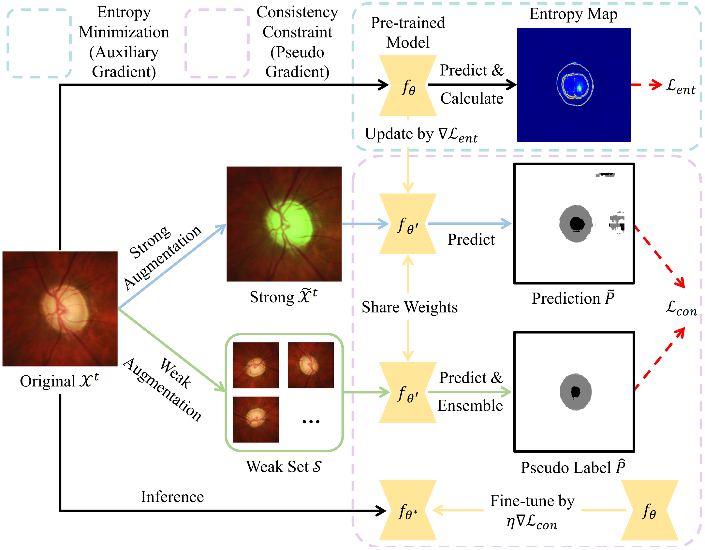

# :page_facing_up: GraTa
This is the official pytorch implementation of our AAAI 2025 paper "[Gradient Alignment Improves Test-Time Adaptation for Medical Image Segmentation](https://arxiv.org/pdf/2408.07343)".

<div align="center">
  
</div>

## Environment
```
CUDA 10.1
Python 3.7.0
Pytorch 1.8.0
CuDNN 8.0.5
```
Our Anaconda environment is also available for download from [Google Drive](https://drive.google.com/file/d/1vAEyFrJ_wLiLwNJfBTg6J-wC9CbzCLmn/view?usp=sharing).

Upon decompression, please move ```czy_pytorch``` to ```your_root/anaconda3/envs/```. Then the environment can be activated by ```conda activate czy_pytorch```.

## Data Preparation
The preprocessed data can be downloaded from [Google Drive](https://drive.google.com/file/d/12NV_QtWgHjFCuUDUWzxMp2rj6_t2cxep/view?usp=drive_link).

## Pre-trained Models
Download pre-trained models from [Google Drive](https://drive.google.com/drive/folders/1EDVr5idaj5R4kpVodljAmPRfz38i221D?usp=sharing) and drag the folder 'models' into the folder 'GraTa-master'.

You can also train your own models.

## How to Run
Please first modify the root in ```run.sh```, and then run the following command to reproduce the results.
```
bash run.sh
```

## Citation ✏️
If this code is helpful for your research, please cite:
```
@article{chen2025grata,
  title={Gradient Alignment Improves Test-Time Adaptation for Medical Image Segmentation},
  author={Chen, Ziyang and Ye, Yiwen and Pan, Yongsheng and Xia, Yong},
  booktitle={Proceedings of the AAAI Conference on Artificial Intelligence},
  year={2025}
}
```

## Contact
Ziyang Chen (zychen@mail.nwpu.edu.cn)
